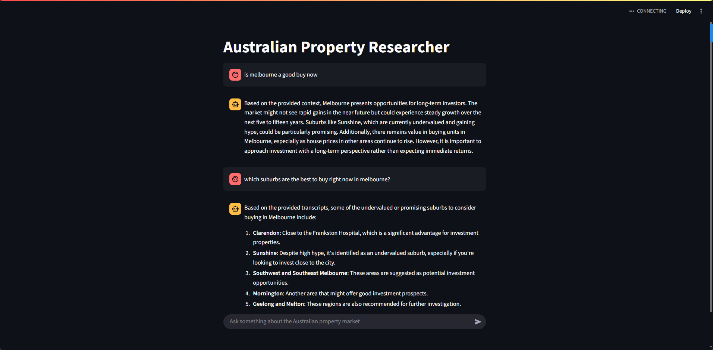

# 🏠 Australian Property Market Researcher
Welcome to my Australian Property Researcher LLM. The purpose of this project is for me to practice data science and machine learning skills by creating a simple web app end-to-end.

---

## Table of Contents
- [Skills](#skills)  
- [Motivation](#motivation)  

---

## Skills
What skills I've practiced:  
- Basic web scraping (`yt_dlp`)
- Text transcription (`PyTorch`, `Whisper`)
- LLMs (`Ollama`, `Huggingface`)
- Text processing (`Langchain`)
- Vector databases (`Qdrant`)
- Basic web app prototyping (`streamlit`)

---

## Motivation
Recently I have gained interest in the property market. Since I don't have enough time to watch every single video, listen to every podcast and read every article, I wanted to fuse all these sources of information into a localised database and use it as context for queries that I may have.

I'm starting off with just videos first, and then eventually adding other data sources as well as the property metrics database that I pull to monthly.